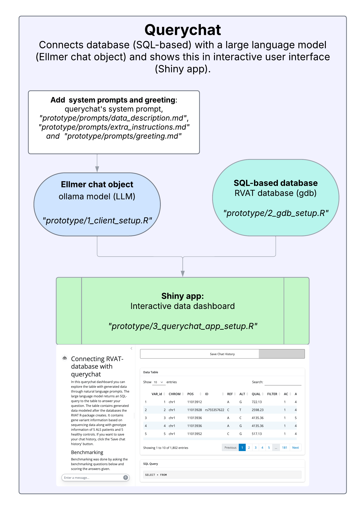

# llm_rvat_integration_av
Building a prototype for matching a large language model to a database generated by rvat through querychat.

## Information
This project attempts to simplify retrieving information from rvat's gdb's (gene databases) by making it possible to ask these questions in natural language. The goal is to make a prototype using Querychat and local Ollama model to generate SQL-queries based on the natural language input of the user (text-to-SQL) and benchmark the answers. The project contains a benchmark method and makes logging of the chat history possible with a 'Save Chat History' button in the Shiny app. 
Below there's a screenshot of the prototype's dashboard.

.png)

## Requirements
- RStudio(Posit)
- R version 4.5.0 (2025-04-11)

## Quick start
If you meet the requirements above, follow these steps for a quick start to launch the querychat app.
1. Clone the Github repository
2. Make a corresponding R project in Rstudio(Posit)
3. Run renv::restore() in console
4. If not installed already, install Ollama locally: https://ollama.com/.
Download clients you want to use that have the capability **tools**, best results up to this point are with qwen3\:8b: https://ollama.com/search?c=tools
5. Select the ollama model by following and running "prototype/1_client_setup.R"
6. Setup gdb database to include 'varInfo_synthetic' table by following and running "prototype/2_gdb_setup.R"
7. The basic system prompt of querychat is used along with a data description and extra instructions added in markdown files. There's also a custom greeting with benchmark questions. If you want to change the prompts or greeting, do so before going to next step. Paths and information are found below*.
8. Setup and launch shinyapp through querychat by following and running "prototype/3_querychat_app_setup.R"

#### * Path to greeting and prompts
**Path greeting:** *"prototype/prompts/greeting.md"*  
More information is found here: https://posit-dev.github.io/querychat/r/articles/greet.html  
  
**Path data description:** *"prototype/prompts/data_desctiption.md"*  
**Path extra instructions:** *"prototype/prompts/extra_instructions.md"*  
More information is found here: https://posit-dev.github.io/querychat/r/articles/context.html
